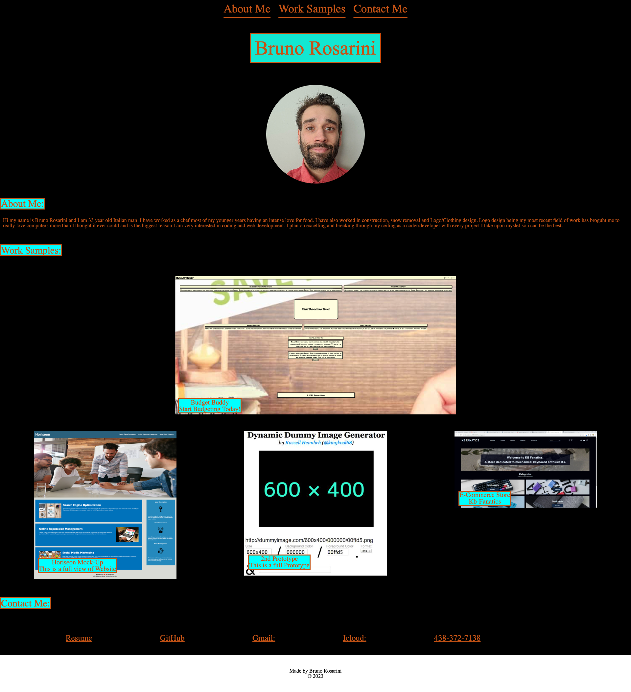

# Career Portfolio

## Description:
```
- Made all images responsive with links.
- Used Media Queries to add functionality to resizing of the webpage.
- Created Navbar links to redirect user to appropriate sections.
- Created webpage to present my projects for potential Employers. 
```
## Mock Up:

()

## Author: 
```
Bruno Rosarini 
 ```
## Top Contributers:
```
- Keegan Omel
- Austin Grech
```
## Contributers:
```
- Krishna - Assistant Instructor / TA
- Patrick Meehan Tutor
```
## Live link 

url: https://rdysetshine.github.io/My-Portfolio-Assignment/
